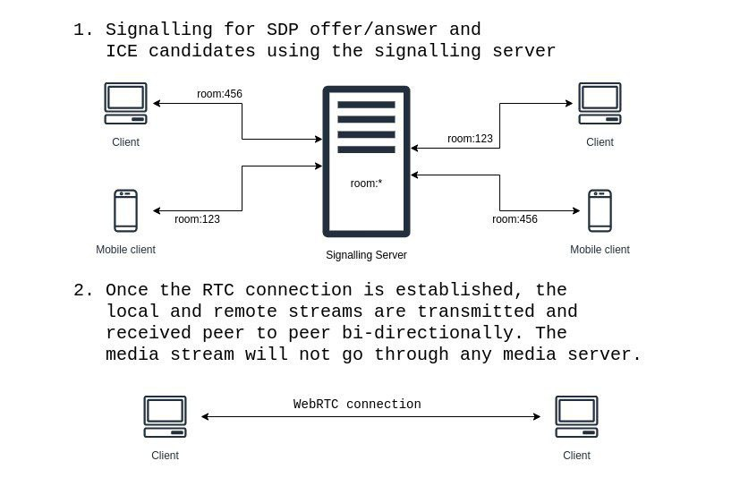

# Client 

- WebRTC peer client written in pure JavaScript without use of any third-party libraries.
- Uses only the WebRTC api and WebSocket api already provided by the Web API
- Signalling SDP offer and answer is performed by a custom signalling server written in Elixir.

### Usage:
- Enter a room id (alphanumeric)
- Click "Join Room"
- If you are starting the room, send the room id to your peer.
- If you are joining the room, simply enter the room id given to you.

### Architecture:

Test it out here: https://kyalsinlinlett.github.io/p2p-client/
